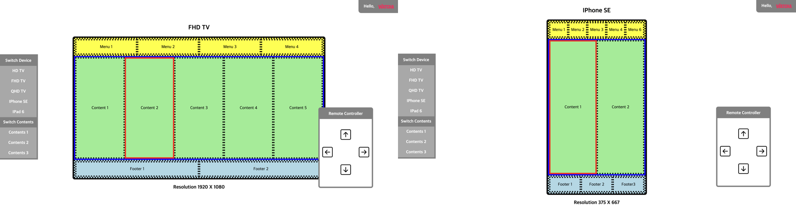

# 포커스 컨트롤 연습

작업 날짜: 2022.4.28

https://peppermintc.github.io/tv-focus-control/



---

## 명령어

- `yarn install`: node_modules를 설치합니다.
- `yarn start`: 프로젝트를 실행합니다.

## 실행 방법

1. node_modules를 설치합니다. `yarn install`
2. 클라이언트 서버를 시작합니다. `yarn start`

---

## 설명

- 포커스 컨트롤 토이 프로젝트를 만들어 보았습니다.
- 각각의 페이지들은 디바이스와 리모컨 컴포넌트를 가지고 있습니다.
- 디바이스는 웹앱을 가장한 컨텐츠 컴포넌트를 가지고 있습니다.
- 컨텐츠와 장치는 좌편의 네이게이션바로 변경할 수 있습니다.
- 포커싱은 먼저 Header, Body, Footer 중 하나를 선택한 뒤, 세부 선택은 좌우로 이동하도록 구현하였습니다.

---

## 사용 기술

- eslint
- prettier
- create-react-app
- typescript
- react-router
- styled-components
- github-pages

---

## 경로

- HD 페이지: `http://localhost:3000/hd`
- FHD 페이지: `http://localhost:3000/fhd`
- QHD 페이지: `http://localhost:3000/qhd`
- IPhone SE 페이지: `http://localhost:3000/iphone`
- IPad 페이지: `http://localhost:3000/ipad`

---

## 폴더 구조

```
src
├── components
│   ├── common  // 일반 컴포넌트들을 보관합니다.
│   │   ├── HelloWatcha.tsx
│   │   └── NavigationBar.tsx
│   ├── contents  // TV 앱 컨텐츠 구성 컴포넌트들을 보관합니다.
│   │   ├── Body.tsx
│   │   ├── Contents.tsx
│   │   ├── Footer.tsx
│   │   └── Header.tsx
│   └── hardware  // 각종 장치 컴포넌트들과 리모컨 컴포넌트를 보관합니다.
│       ├── Mobile.tsx
│       ├── Remote.tsx
│       ├── TV.tsx
│       └── Tablet.tsx
├── data  // 데이터 보관 폴더입니다.
├── img // 이미지 파일들을 저장합니다.
├── interfaces  // 공통적으로 사용되는 타입스크립트 인터페이스들을 저장합니다.
├── pages // 페이지 컴포넌트들을 보관합니다.
│   ├── FHDPage.tsx
│   ├── HDPage.tsx
│   ├── IPad6Page.tsx
│   ├── IPhoneSEPage.tsx
│   └── QHDPage.tsx
```
